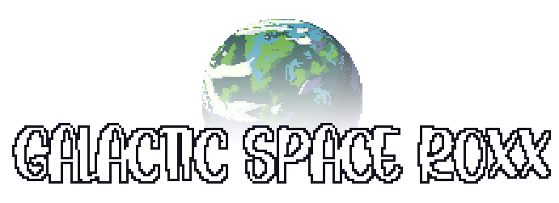

<!-- PROJECT SHIELDS -->
<!--
*** I'm using markdown "reference style" links for readability.
*** Reference links are enclosed in brackets [ ] instead of parentheses ( ).
*** See the bottom of this document for the declaration of the reference variables
*** for contributors-url, forks-url, etc. This is an optional, concise syntax you may use.
*** https://www.markdownguide.org/basic-syntax/#reference-style-links
-->

<!-- PROJECT LOGO -->
 

  

  

    An arcade style game made by Itai Singer
  

<!-- ABOUT THE PROJECT -->
## About The Project

Space R0XX is a solo project game made by me in 3 months as a hobby project.

### Built With

* Game Maker Studio 2
* Ableton
* <a href="https://codemanu.itch.io/particle-fx-designer">Pixel fx Designer</a>

## Contact

Itai Singer
email: itai5000si@gmail.com
